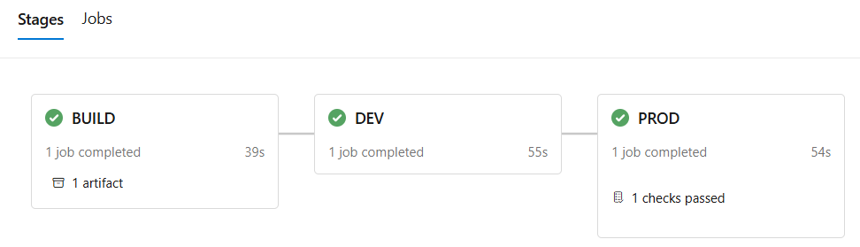

# CICD Azure Data Factory using Azure Devops Project

This project demonstrates a CI/CD pipeline for automating the deployment of Azure Data Factory and Data Lake using ARM templates in Azure DevOps. It also includes a typical real-life scenario for handling hotfixes in Production, ensuring efficient and reliable updates.

The [Azure enterprise templates](https://github.com/MarczakIO/azure-enterprise-templates) provided by Adam Marczak. 

## A Typical Flow
The pipeline follows industry-standard practices for version control and deployment:

- **Development Workflow:**  
  Developers work on feature branches and integrate changes into the main branch via Pull Requests (PRs).

- **Continuous Integration (CI):**  
  Upon merging feature branches into the main branch, the build job is triggered, producing artifact ARM templates.

- **Continuous Deployment (CD):**  
  The pipeline deploys to the Dev environment initially, and after successful review and approval, the deployment proceeds to the Prod environment. To simplify the process, the Test environment is excluded. 

More details about the typical flow demo can be found in [demo-typical-flow-note](/notes/2.demo-typical-flow-note.md) 

## Hotfix Flow

### Problem: real-life handling a hotfix in PROD Scenario:   

1. A feature branch **`feat2`** was developed, approved via PR, and merged into `main`. It is waiting for review and approval before deployment to `PROD`.  
2. An urgent hotfix **(`fixfeat1`)** is needed in `PROD`, but **`feat2`** should not be included in this deployment.  
   - If we follow the typical flow, **`feat2`** would be deployed along with hotfix **`fixfeat1`**, which is not desirable.  
3. We still want to keep **`feat2`** in `main` for later review and deployment.  

### Solution:

1. **Create a hotfix branch** from the current `PROD` version.  
   - This branch reflects the exact state of `PROD`, **excluding `feat2`**.  
   - **Manually trigger the pipeline** from this hotfix branch to deploy **only `fixfeat1`** to `PROD`.  

2. **Merge the hotfix branch into `main`**.  
   - This ensures that `main` now contains both **`fixfeat1`** (the hotfix) and **`feat2`** (the pending feature), keeping it up to date for future deployments.  

3. **Cancel the previous pipeline run that included only `feat2`**.  
   - This prevents deploying an outdated version that **excludes** the hotfix.

This approach ensures that urgent fixes are deployed independently while keeping ongoing feature work in sync with `main`.

More details about the hotfix flow can be found in [hotfix-flow-note](/notes/3.hotfix-flow-note.md) 

## Services Used
- Azure Data Factory: Orchestrates data workflows and pipeline automation. 
- Azure Data Lake: Stores and manages large-scale data, linked with Data Factory.  
- Entra ID: Manages secure access and authentication. 
- Azure DevOps: Facilitates CI/CD, version control, and deployment automation.

Initial setup can be found in [setup-note](/notes/1.setup-note.md)

